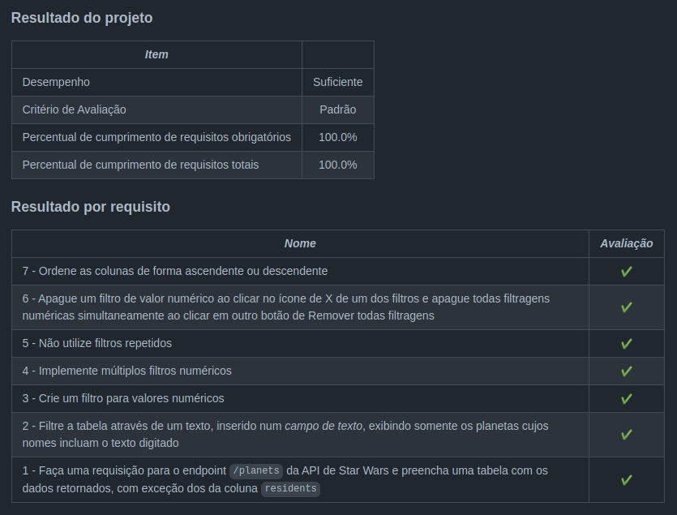

<h1>Sobre</h1>

Oitavo projeto do módulo 2 - Front-end, da <a href="https://betrybe.com" target="_blank">Trybe!</a>

O desafio foi criar uma aplicação mostrando todos os planetas de Starwars (adquiridos através de uma API) e suas informações.

Nele é possível filtrar e ordenar os planetas de acordo com as informações escolhidas pelo usuário. 

<h1>Instalando</h1>

Para instalar, basta executar o comando <code>npm install</code> no diretório raiz do projeto.

Logo depois execute o comando <code>npm start</code>

<h1>Tecnologias utilizadas</h1>

<ul>
  <li>React</li>
  <li>JavaScript</li>
</ul>

<h1>Nota</h1>
